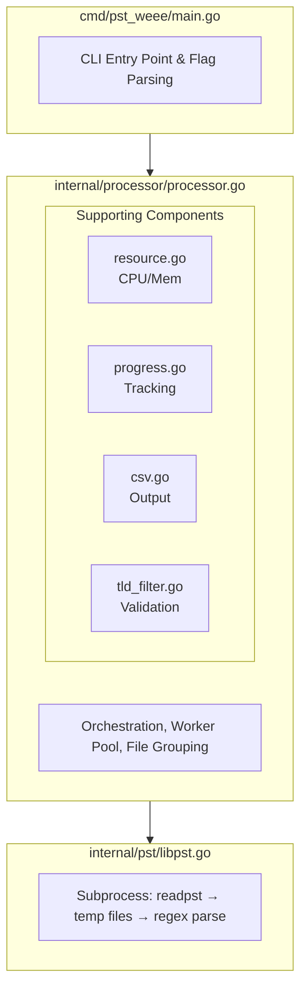
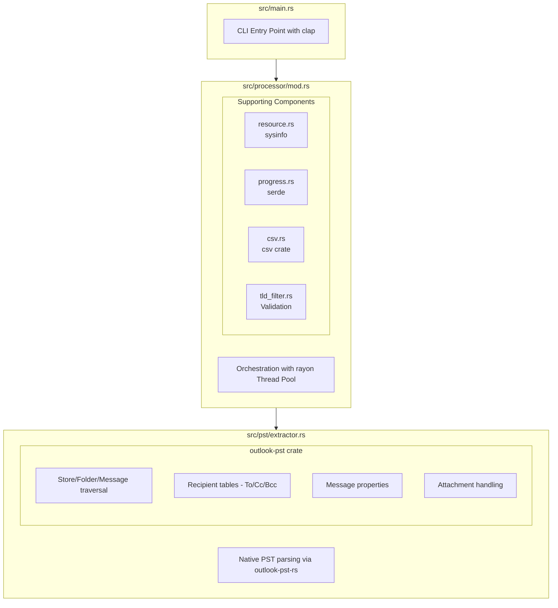
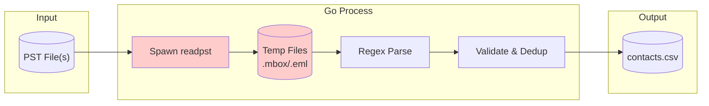
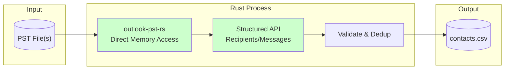
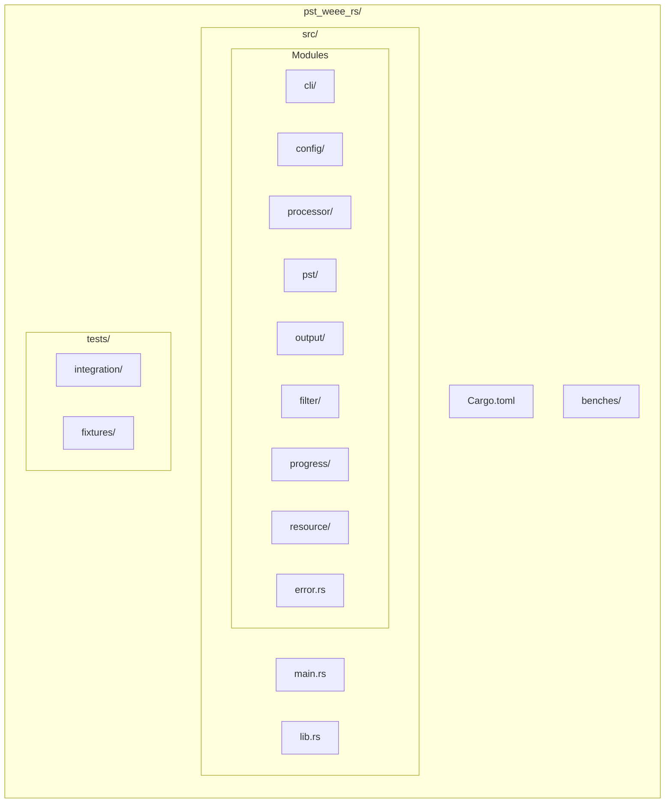
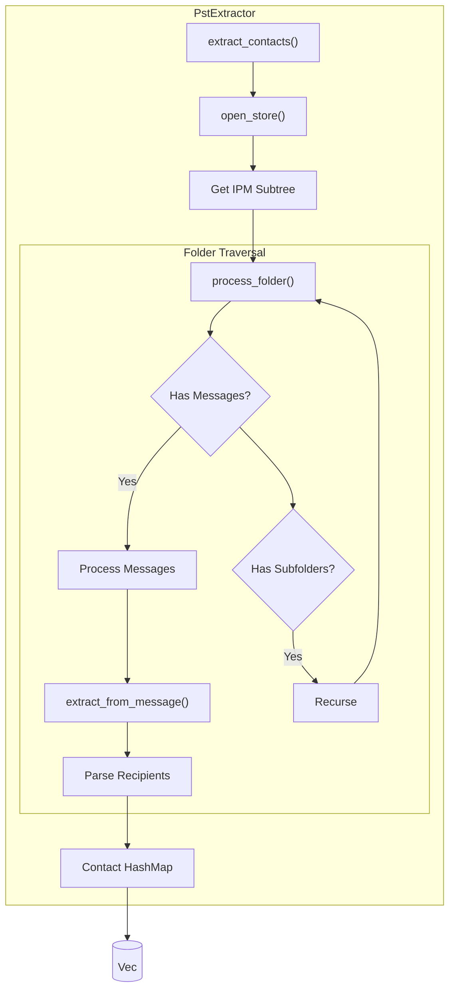
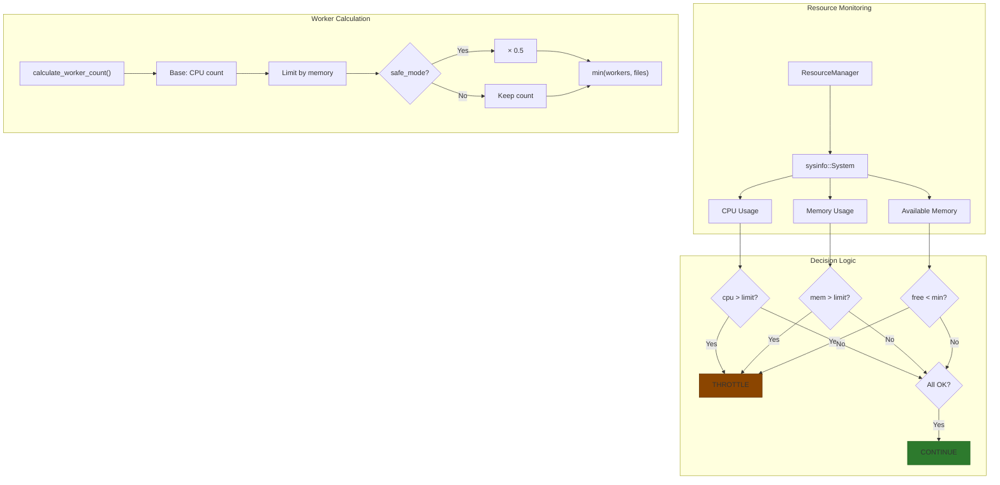
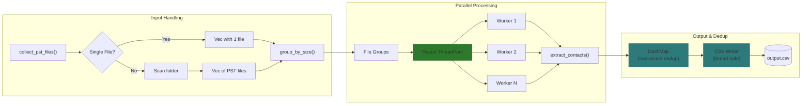
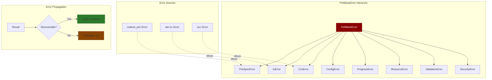
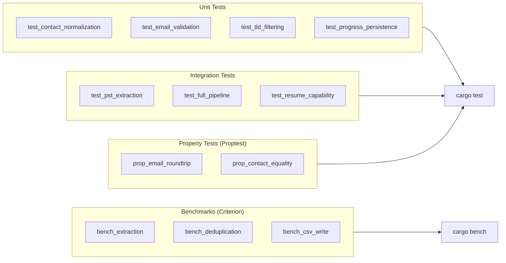

# PST WEEE Rust Architecture

## Executive Summary

This document outlines the architecture for reimplementing PST WEEE in Rust, leveraging
Microsoft's official `outlook-pst-rs` library for native PST parsing. The new
implementation eliminates external dependencies on `libpst`/`readpst`, provides
better performance through direct memory access to PST structures, and maintains
full feature parity with the existing Go implementation.

---

## Current Go Architecture



### Current Bottlenecks

1. **Subprocess overhead**: Spawning `readpst` for each PST file
2. **Disk I/O**: Extracting to temporary files, then reading them back
3. **Text parsing**: Regex-based extraction from unstructured mbox/eml output
4. **External dependency**: Requires `libpst` installed on the system

---

## Proposed Rust Architecture



---

## Data Flow Comparison

### Go Implementation (Current)



### Rust Implementation (Proposed)



---

## Module Structure



### Detailed Module Breakdown

```text
pst_weee_rs/
├── Cargo.toml
├── Cargo.lock
├── README.md
├── build.rs                    # Build script (optional, for version info)
│
├── src/
│   ├── main.rs                 # Entry point, CLI argument parsing
│   ├── lib.rs                  # Library root (re-exports)
│   │
│   ├── cli/
│   │   └── mod.rs              # CLI argument definitions (clap)
│   │
│   ├── config/
│   │   └── mod.rs              # Configuration structures
│   │
│   ├── processor/
│   │   ├── mod.rs              # Processor orchestration
│   │   ├── worker.rs           # Worker pool implementation
│   │   ├── file_group.rs       # File grouping by size
│   │   └── contacts.rs         # Contact deduplication & storage
│   │
│   ├── pst/
│   │   ├── mod.rs              # PST module root
│   │   ├── extractor.rs        # Contact extraction from PST
│   │   ├── message.rs          # Message parsing helpers
│   │   └── recipient.rs        # Recipient parsing (To/Cc/Bcc)
│   │
│   ├── output/
│   │   ├── mod.rs              # Output module root
│   │   ├── csv.rs              # Thread-safe CSV writer
│   │   └── post_processor.rs   # Post-processing (dedup, validation)
│   │
│   ├── filter/
│   │   ├── mod.rs              # Filter module root
│   │   ├── email.rs            # Email validation patterns
│   │   └── tld.rs              # TLD validation & download
│   │
│   ├── progress/
│   │   ├── mod.rs              # Progress tracking
│   │   └── persistence.rs      # JSON save/load
│   │
│   ├── resource/
│   │   ├── mod.rs              # Resource monitoring
│   │   └── limits.rs           # CPU/Memory limit enforcement
│   │
│   └── error.rs                # Custom error types (thiserror)
│
├── tests/
│   ├── integration/
│   │   ├── mod.rs
│   │   └── extraction_test.rs
│   └── fixtures/
│       └── sample.pst          # Test PST files
│
└── benches/
    └── extraction_bench.rs     # Performance benchmarks
```

---

## Core Data Structures

### Contact

```rust
/// Represents an extracted email contact
#[derive(Debug, Clone, PartialEq, Eq, Hash, Serialize, Deserialize)]
pub struct Contact {
    /// Email address (lowercase, trimmed)
    pub email: String,
    /// Display name associated with the email (optional)
    pub display_name: Option<String>,
}

impl Contact {
    pub fn new(email: impl Into<String>, display_name: Option<String>) -> Self {
        Self {
            email: email.into().to_lowercase().trim().to_string(),
            display_name: display_name.map(|s| s.trim().to_string()),
        }
    }
}
```

### Configuration

```rust
/// Processor configuration mirroring Go implementation
#[derive(Debug, Clone, Serialize, Deserialize)]
pub struct Config {
    /// Path to folder containing PST files
    pub folder_path: PathBuf,
    /// Path to output CSV file
    pub output_path: PathBuf,
    /// Maximum CPU usage percentage (0-100)
    pub cpu_limit: f64,
    /// Maximum memory usage percentage (0-100)
    pub memory_limit: f64,
    /// Minimum free memory in GB
    pub min_free_memory_gb: u64,
    /// Maximum number of worker threads (0 = auto)
    pub max_workers: usize,
    /// Skip checking for available disk space
    pub ignore_space_check: bool,
    /// Enable safe mode with more conservative resource usage
    pub safe_mode: bool,
    /// Enable debug logging
    pub debug_mode: bool,
    /// Disable filtering of invalid TLDs
    pub disable_tld_filter: bool,
    /// Extract attachments when processing PSTs
    pub extract_attachments: bool,
    /// Size of chunks for processing in MB
    pub chunk_size_mb: usize,
    /// Maximum username length for email filtering
    pub max_username_length: usize,
}

impl Default for Config {
    fn default() -> Self {
        Self {
            folder_path: PathBuf::new(),
            output_path: PathBuf::from("contacts.csv"),
            cpu_limit: 70.0,
            memory_limit: 70.0,
            min_free_memory_gb: 2,
            max_workers: 0,  // auto
            ignore_space_check: false,
            safe_mode: false,
            debug_mode: false,
            disable_tld_filter: false,
            extract_attachments: false,
            chunk_size_mb: 32,
            max_username_length: 20,
        }
    }
}
```

### Progress Tracking

```rust
/// Persistent progress tracking for resumable processing
#[derive(Debug, Clone, Serialize, Deserialize)]
pub struct Progress {
    /// Set of completed file names
    pub completed_files: HashSet<String>,
    /// Currently processing file
    pub current_file: Option<String>,
    /// Total contacts found
    pub contacts_found: u64,
    /// Total bytes read
    pub bytes_read: u64,
    /// Profile name (optional)
    pub profile_name: Option<String>,
    /// Additional config options
    #[serde(default)]
    pub config_options: HashMap<String, serde_json::Value>,
}
```

---

## Key Component Designs

### 1. PST Extractor (Core Innovation)

The extractor directly uses `outlook-pst-rs` APIs instead of subprocess calls:



```rust
use outlook_pst::{open_store, messaging::store::Store};

pub struct PstExtractor {
    debug_mode: bool,
    max_username_length: usize,
}

impl PstExtractor {
    /// Extract contacts from a PST file using native parsing
    pub fn extract_contacts(&self, pst_path: &Path) -> Result<Vec<Contact>> {
        let store = open_store(pst_path)?;
        let mut contacts = HashMap::new();

        // Get root folder and traverse hierarchy
        let root_entry_id = store.properties().ipm_sub_tree_entry_id()?;
        let root_folder = store.open_folder(&root_entry_id)?;

        self.process_folder(&store, &root_folder, &mut contacts)?;

        Ok(contacts.into_values().collect())
    }

    fn process_folder(
        &self,
        store: &dyn Store,
        folder: &dyn Folder,
        contacts: &mut HashMap<String, Contact>,
    ) -> Result<()> {
        // Process messages in this folder
        if let Some(contents_table) = folder.contents_table() {
            for row in contents_table.rows_matrix() {
                let entry_id = store.properties()
                    .make_entry_id(NodeId::from(u32::from(row.id())))?;
                let message = store.open_message(&entry_id, None)?;

                self.extract_from_message(&message, contacts)?;
            }
        }

        // Recurse into subfolders
        if let Some(hierarchy_table) = folder.hierarchy_table() {
            for row in hierarchy_table.rows_matrix() {
                let entry_id = store.properties()
                    .make_entry_id(NodeId::from(u32::from(row.id())))?;
                let subfolder = store.open_folder(&entry_id)?;
                self.process_folder(store, &subfolder, contacts)?;
            }
        }

        Ok(())
    }

    fn extract_from_message(
        &self,
        message: &dyn Message,
        contacts: &mut HashMap<String, Contact>,
    ) -> Result<()> {
        let recipient_table = message.recipient_table();

        for row in recipient_table.rows_matrix() {
            // Extract email and display name from recipient properties
            // Property IDs: 0x3001 (display name), 0x39FE (SMTP address)
            if let Some(contact) = self.parse_recipient(&recipient_table, &row)? {
                contacts.entry(contact.email.clone()).or_insert(contact);
            }
        }

        Ok(())
    }
}
```

### 2. Thread-Safe CSV Writer

```rust
use std::sync::{Arc, Mutex};
use csv::Writer;

pub struct CsvWriter {
    inner: Arc<Mutex<CsvWriterInner>>,
    flush_interval: Duration,
    debug_mode: bool,
}

struct CsvWriterInner {
    writer: Writer<BufWriter<File>>,
    record_count: u64,
    last_flush: Instant,
}

impl CsvWriter {
    pub fn new(output_path: &Path, debug_mode: bool) -> Result<Self> {
        let file = File::create(output_path)?;
        let buf_writer = BufWriter::with_capacity(64 * 1024, file);
        let mut writer = Writer::from_writer(buf_writer);

        // Write header
        writer.write_record(&["Email", "DisplayName"])?;
        writer.flush()?;

        Ok(Self {
            inner: Arc::new(Mutex::new(CsvWriterInner {
                writer,
                record_count: 0,
                last_flush: Instant::now(),
            })),
            flush_interval: Duration::from_secs(30),
            debug_mode,
        })
    }

    pub fn write_contact(&self, contact: &Contact) -> Result<()> {
        let mut inner = self.inner.lock().unwrap();
        inner.writer.write_record(&[
            &contact.email,
            contact.display_name.as_deref().unwrap_or(""),
        ])?;
        inner.record_count += 1;
        Ok(())
    }

    pub fn flush(&self) -> Result<()> {
        let mut inner = self.inner.lock().unwrap();
        inner.writer.flush()?;
        inner.last_flush = Instant::now();
        Ok(())
    }
}
```

### 3. Resource Manager



```rust
use sysinfo::{System, SystemExt, CpuExt};

pub struct ResourceManager {
    system: System,
    limits: ResourceLimits,
    safe_mode: bool,
}

#[derive(Debug, Clone)]
pub struct ResourceLimits {
    pub cpu_percent: f64,
    pub memory_percent: f64,
    pub min_free_memory: u64,  // bytes
}

impl ResourceManager {
    pub fn new(limits: ResourceLimits, safe_mode: bool) -> Self {
        Self {
            system: System::new_all(),
            limits,
            safe_mode,
        }
    }

    pub fn calculate_worker_count(&mut self, file_count: usize) -> usize {
        self.system.refresh_all();

        let cpu_count = self.system.cpus().len();
        let available_memory = self.system.available_memory();

        // Base calculation on CPU count
        let mut workers = cpu_count;

        // Adjust for memory constraints
        let memory_per_worker = 512 * 1024 * 1024;  // 512MB estimate per worker
        let memory_limited = (available_memory / memory_per_worker) as usize;
        workers = workers.min(memory_limited);

        // Apply safe mode reduction
        if self.safe_mode {
            workers = (workers as f64 * 0.5) as usize;
        }

        // Ensure at least 1 worker, but no more than file count
        workers.max(1).min(file_count)
    }

    pub fn should_throttle(&mut self) -> bool {
        self.system.refresh_cpu();
        self.system.refresh_memory();

        let cpu_usage: f64 = self.system.cpus()
            .iter()
            .map(|cpu| cpu.cpu_usage() as f64)
            .sum::<f64>() / self.system.cpus().len() as f64;

        let memory_usage = (self.system.used_memory() as f64
            / self.system.total_memory() as f64) * 100.0;

        let free_memory = self.system.available_memory();

        cpu_usage > self.limits.cpu_percent
            || memory_usage > self.limits.memory_percent
            || free_memory < self.limits.min_free_memory
    }
}
```

### 4. Parallel Processing with Rayon



```rust
use rayon::prelude::*;
use crossbeam_channel::{bounded, Sender};

pub struct Processor {
    config: Config,
    csv_writer: Arc<CsvWriter>,
    progress: Arc<Mutex<Progress>>,
    resource_mgr: Arc<Mutex<ResourceManager>>,
    tld_filter: Option<TldFilter>,
    contacts: DashMap<String, Contact>,
}

impl Processor {
    pub fn process(&self) -> Result<()> {
        let files = self.collect_pst_files()?;
        let file_groups = self.group_by_size(&files);

        for group in file_groups {
            self.process_file_group(group)?;
        }

        // Post-processing
        let post_processor = PostProcessor::new(&self.config.output_path);
        post_processor.process()?;

        Ok(())
    }

    fn process_file_group(&self, files: Vec<PathBuf>) -> Result<()> {
        // Filter completed files
        let remaining: Vec<_> = files
            .into_iter()
            .filter(|f| {
                let progress = self.progress.lock().unwrap();
                !progress.completed_files.contains(&f.file_name().unwrap().to_string_lossy().to_string())
            })
            .collect();

        if remaining.is_empty() {
            return Ok(());
        }

        // Calculate worker count
        let worker_count = {
            let mut mgr = self.resource_mgr.lock().unwrap();
            if self.config.max_workers > 0 {
                self.config.max_workers
            } else {
                mgr.calculate_worker_count(remaining.len())
            }
        };

        // Configure rayon thread pool
        let pool = rayon::ThreadPoolBuilder::new()
            .num_threads(worker_count)
            .build()?;

        // Process files in parallel
        let extractor = PstExtractor::new(self.config.debug_mode, self.config.max_username_length);

        pool.install(|| {
            remaining.par_iter().for_each(|file| {
                match extractor.extract_contacts(file) {
                    Ok(contacts) => {
                        self.process_contacts(contacts);

                        // Mark file complete
                        let mut progress = self.progress.lock().unwrap();
                        progress.completed_files.insert(
                            file.file_name().unwrap().to_string_lossy().to_string()
                        );
                        let _ = progress.save();
                    }
                    Err(e) => {
                        log::error!("Error processing {:?}: {}", file, e);
                    }
                }
            });
        });

        Ok(())
    }

    fn process_contacts(&self, contacts: Vec<Contact>) {
        for contact in contacts {
            // Validate email
            if !self.validate_contact(&contact) {
                continue;
            }

            // Deduplicate and store
            if !self.contacts.contains_key(&contact.email) {
                self.contacts.insert(contact.email.clone(), contact.clone());

                // Write to CSV
                if let Err(e) = self.csv_writer.write_contact(&contact) {
                    log::error!("Failed to write contact: {}", e);
                }
            }
        }
    }
}
```

---

## Crate Dependencies

```toml
[package]
name = "pst_weee"
version = "0.2.0"
edition = "2021"
authors = ["Your Name <email@example.com>"]
description = "High-performance email contact extractor for Microsoft Outlook PST files"
license = "MIT"
repository = "https://github.com/greysquirr3l/pst_weee"

[dependencies]
# PST parsing - the star of the show!
outlook-pst = "1.1"
compressed-rtf = "1.0"  # For RTF body decoding (optional)

# CLI
clap = { version = "4", features = ["derive"] }

# Parallelism
rayon = "1.8"
crossbeam-channel = "0.5"
dashmap = "5"

# Async (for TLD download)
tokio = { version = "1", features = ["rt-multi-thread", "fs", "net"] }
reqwest = { version = "0.11", features = ["blocking"] }

# Serialization
serde = { version = "1", features = ["derive"] }
serde_json = "1"

# CSV output
csv = "1.3"

# System monitoring
sysinfo = "0.29"

# Logging
log = "0.4"
env_logger = "0.10"

# Error handling
thiserror = "1"
anyhow = "1"

# Validation
regex = "1"
lazy_static = "1"

# Progress display
indicatif = "0.17"

[dev-dependencies]
tempfile = "3"
criterion = "0.5"
proptest = "1"

[[bench]]
name = "extraction"
harness = false
```

---

## Error Handling Strategy



```rust
use thiserror::Error;

#[derive(Error, Debug)]
pub enum PstWeeeError {
    #[error("Failed to open PST file: {0}")]
    PstOpenError(#[from] outlook_pst::Error),

    #[error("IO error: {0}")]
    IoError(#[from] std::io::Error),

    #[error("CSV error: {0}")]
    CsvError(#[from] csv::Error),

    #[error("Invalid configuration: {0}")]
    ConfigError(String),

    #[error("Progress persistence error: {0}")]
    ProgressError(String),

    #[error("Resource limit exceeded: {0}")]
    ResourceError(String),

    #[error("Email validation failed: {0}")]
    ValidationError(String),

    #[error("Security error: {0}")]
    SecurityError(String),
}

pub type Result<T> = std::result::Result<T, PstWeeeError>;
```

---

## Testing Strategy



### Unit Tests

```rust
#[cfg(test)]
mod tests {
    use super::*;

    #[test]
    fn test_contact_normalization() {
        let contact = Contact::new("  John@Example.COM  ", Some("  John Doe  ".into()));
        assert_eq!(contact.email, "john@example.com");
        assert_eq!(contact.display_name, Some("John Doe".to_string()));
    }

    #[test]
    fn test_email_validation() {
        assert!(validate_email("user@example.com", 20));
        assert!(!validate_email("invalid", 20));
        assert!(!validate_email("verylongusernamethatexceeds@example.com", 20));
    }
}
```

### Integration Tests

```rust
#[test]
fn test_pst_extraction() {
    let test_pst = Path::new("tests/fixtures/sample.pst");
    if !test_pst.exists() {
        return;  // Skip if no test file
    }

    let extractor = PstExtractor::new(true, 20);
    let contacts = extractor.extract_contacts(test_pst).unwrap();

    assert!(!contacts.is_empty());
}
```

---

## Performance Considerations

1. **Memory-mapped files**: `outlook-pst-rs` uses efficient file access
2. **Zero-copy parsing**: Minimizes allocations during PST traversal
3. **Parallel processing**: `rayon` provides work-stealing parallelism
4. **DashMap**: Lock-free concurrent hash map for contact deduplication
5. **Buffered I/O**: Large buffers for CSV writing
6. **Lazy TLD loading**: Only fetches TLD list when needed

---

## Migration Compatibility

| Go Feature | Rust Equivalent | Notes |
| ------------ | ----------------- | ------- |
| CLI flags | `clap` derive macros | Same flag names maintained |
| CSV output | `csv` crate | Identical output format |
| Progress JSON | `serde_json` | Same JSON schema |
| Worker pool | `rayon` | More efficient work stealing |
| sync.Map | `DashMap` | Lock-free alternative |
| gopsutil | `sysinfo` | Cross-platform system info |

---

## Security Considerations

1. **Path traversal prevention**: All file paths validated against base directory
2. **No shell execution**: Eliminates command injection risks from subprocess
3. **Memory safety**: Rust's ownership model prevents buffer overflows
4. **Input validation**: Email addresses validated before storage
